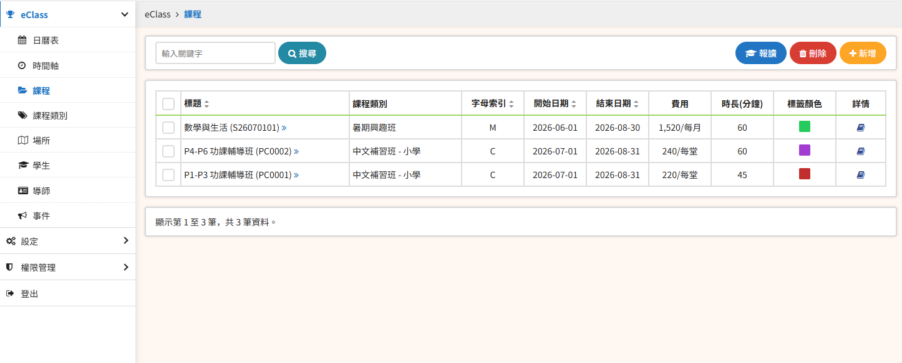
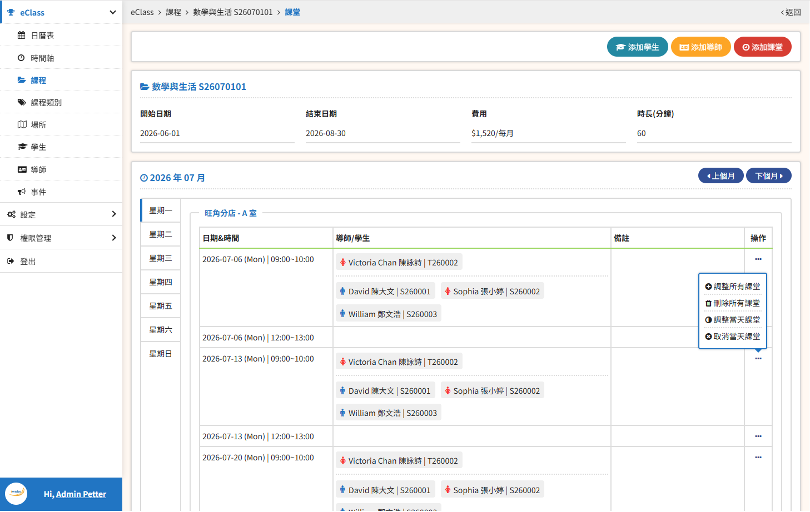
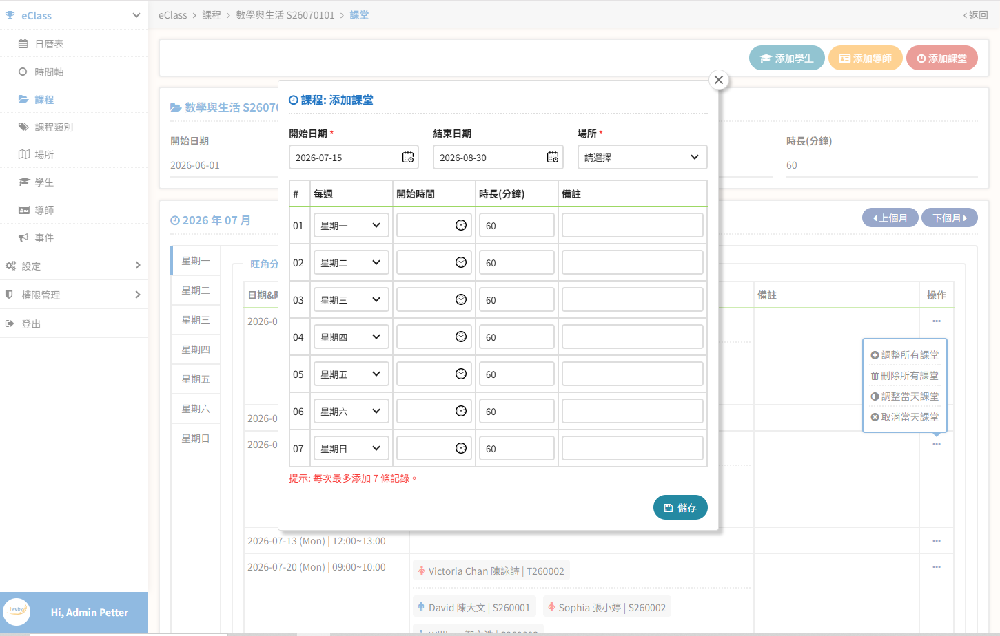
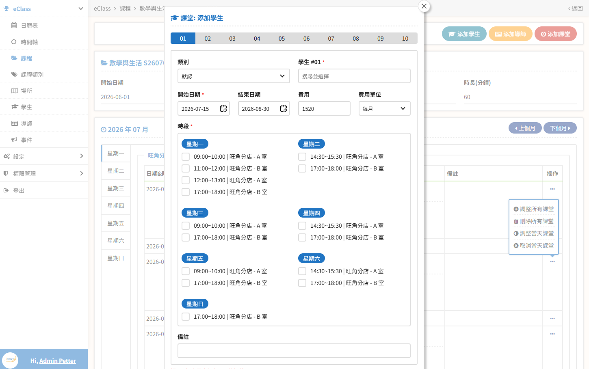
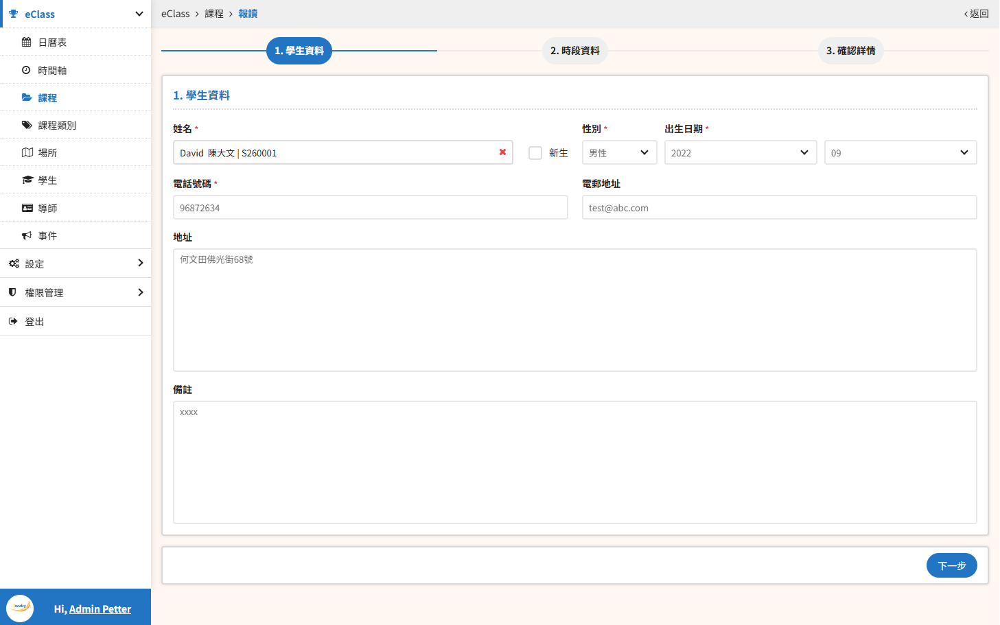
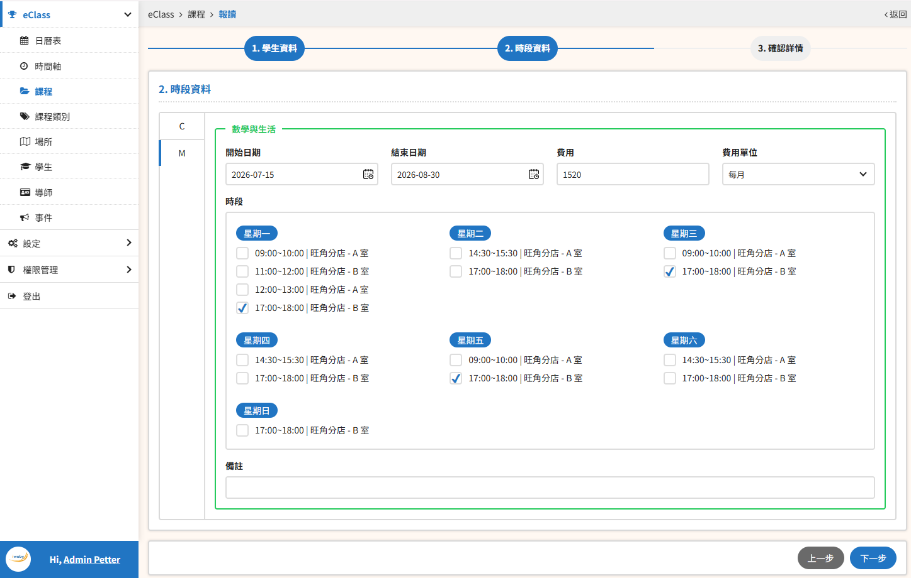
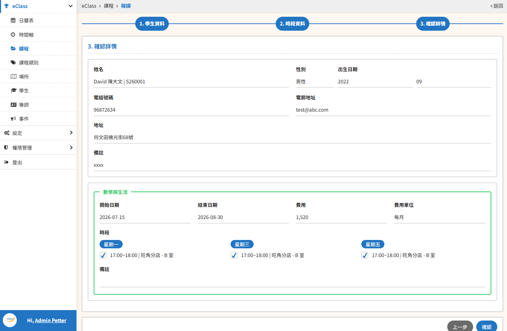

**E-Class Management System E-Class 管理系統**  

A lightweight and modular class management system built for educational organizations. It provides core functionalities including calendar view, timeline tracking, course and category management, venue/slot allocation, student and tutor profiles, and event scheduling. Designed to simplify daily administrative operations and enhance coordination between students, tutors, and administrators.

一套輕量化、模組化的班級管理系統，專為教育機構日常營運打造。核心功能包含日曆檢視、時間軸追蹤、課程與類別管理、場所/時段分配、學生與導師資料維護，以及事件排程。旨在簡化行政作業流程，提升學生、導師與管理者之間的協作效率。

---
# Features / 功能特色
📅 Calendar View – 日曆檢視，掌握每日課程與活動

⏱️ Timeline Tracking – 時間軸追蹤，清楚了解課程進度

📚 Course & Category Management – 課程與類別管理，便於分類與查詢

📍 Venue & Slot Allocation – 場所與時段分配，資源運用更有效率

👩‍🎓 Student & Tutor Profiles – 學生與導師資料維護，資訊統整一目瞭然

📆 Event Scheduling – 事件排程，支援靈活調度與規劃

---
## Course List / 課程列表

---
## Course Schedule (including instructors, students, etc.) / 課程上堂時間表（含導師、學生等）

---
# Batch Add Class Time / 批量添加課堂時間

---
# Add Students to Different Classrooms of a Single Course in Batches / 批量添加學生到單一課程的課堂

---
# Add Students to Different Classrooms of Multiple Courses in Batches / 批量添加學生到多個課程的課堂

